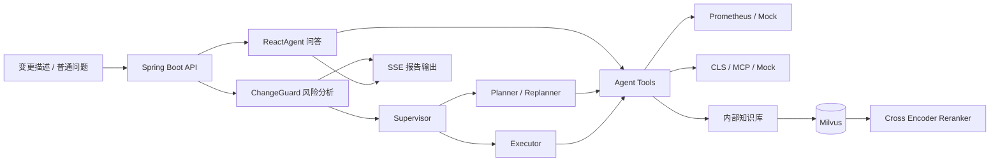

# ChangeGuard AI

ChangeGuard AI 是一个面向发布与配置变更的风险分析和证据决策平台。用户提交变更描述后，系统会结合内部知识库、Prometheus 监控和 CLS 日志，组织多 Agent 进行取证分析，最终输出影响范围、风险等级、验证清单、观察指标和回滚建议。

它解决的问题不是“让模型聊天”，而是把一次变更从自然语言描述转化为一份有证据、有边界的发布决策报告。

## 核心能力

- 变更风险分析：接收发布、配置和依赖升级描述，生成结构化风险报告。
- 多 Agent 取证：Supervisor 调度 Planner 和 Executor，按照规划、取证、再规划流程工作。
- RAG 证据检索：TXT/Markdown 文档经过分片、Embedding、Milvus 召回和可选 Cross Encoder 精排。
- 可观测性工具：查询 Prometheus 活跃告警、Mock/CLS 日志和内部变更手册。
- 多轮问答：保留普通问答、工具调用和 SSE 流式响应能力。
- 工程安全：文件名校验、路径穿越防护、符号链接防护、上传大小限制和索引状态隔离。

## 变更风险分析流程

```text
变更描述
    -> ChangeGuard Supervisor
    -> Planner 制定取证计划
    -> Executor 调用监控、日志和知识库工具
    -> Planner 根据证据重新规划
    -> 输出风险决策报告
```

报告包含：

- 变更摘要；
- 影响服务和依赖；
- 监控、日志和知识库证据；
- 风险等级：低 / 中 / 高；
- 发布前验证清单；
- 发布后观察指标；
- 回滚条件和建议；
- 无法确认的信息。

当前系统只提供辅助决策，不解析真实 Git Diff，也不执行发布、回滚、重启、扩容或配置修改。

## RAG 数据流

```text
TXT / Markdown
    -> 标题与段落分片（最大 800 字符，重叠 100 字符）
    -> OpenAI text-embedding-3-small
    -> Milvus knowledge collection（1536 维，IVF_FLAT）
    -> 向量召回（启用 Rerank 时默认召回 12 条）
    -> Cross Encoder 精排
    -> 最终 Top 3
    -> Agent 基于证据生成风险结论
```

Rerank 默认关闭。开启后默认调用 SiliconFlow 的 `/v1/rerank` 接口和 `BAAI/bge-reranker-v2-m3`；服务异常时默认回退到 Milvus 结果。

## 系统架构



## 技术栈

| 技术 | 用途 |
| --- | --- |
| Java 17 / Spring Boot 3.2 | 后端服务与 REST API |
| Spring AI OpenAI | ChatModel、EmbeddingModel |
| Spring AI Alibaba Agent Framework | ReactAgent、Supervisor、Planner、Executor |
| Milvus | 向量存储与相似度检索 |
| Cross Encoder / Reranker | 候选文档二阶段精排 |
| Prometheus / CLS / MCP | 监控、日志和外部工具数据源 |
| SSE | 问答和风险报告流式输出 |
| Docker Compose | 本地 Milvus 依赖编排 |

## 本地运行

环境要求：JDK 17、Maven 3.9+、Docker Desktop、OpenAI API Key。

ChatGPT Plus 或 Codex 登录状态不能替代 OpenAI API Key。项目只读取本机环境变量，不会把密钥提交到仓库。

### 1. 启动 Milvus

```powershell
docker compose -f vector-database.yml up -d
```

### 2. 配置 OpenAI

```powershell
$env:OPENAI_API_KEY = "你的 OpenAI API Key"
```

如通过代理或兼容网关访问：

```powershell
$env:OPENAI_BASE_URL = "https://你的网关地址"
```

### 3. 可选开启 Rerank

```powershell
$env:RAG_RERANK_ENABLED = "true"
$env:RAG_RERANK_API_KEY = "你的 SiliconFlow API Key"
$env:RAG_RERANK_MODEL = "BAAI/bge-reranker-v2-m3"
$env:RAG_RECALL_TOP_K = "12"
```

OpenAI Key 和 Rerank Key 是两套密钥。

### 4. 启动应用

```powershell
mvn spring-boot:run
```

访问 <http://localhost:9900>。默认 Prometheus 和 CLS 使用 Mock，MCP 关闭，适合本地演示。

首次使用时上传 `aiops-docs` 中的 Markdown 文档，等待向量索引完成。

## API

| 方法 | 路径 | 说明 |
| --- | --- | --- |
| POST | `/api/chat` | 普通 Agent 问答 |
| POST | `/api/chat_stream` | SSE 流式问答 |
| POST | `/api/ai_ops` | SSE 变更风险分析 |
| POST | `/api/upload` | 上传 TXT/Markdown 并建立索引 |
| POST | `/api/chat/clear` | 清空会话历史 |
| GET | `/api/chat/session/{sessionId}` | 查询会话信息 |
| GET | `/milvus/health` | 检查 Milvus 连接 |

变更风险分析：

```powershell
curl.exe -N -X POST http://localhost:9900/api/ai_ops `
  -H "Content-Type: application/json" `
  -d '{"userRequest":"将 payment-service 升级到 v1.5.0，并修改数据库连接池配置"}'
```

上传知识库文档：

```powershell
curl.exe -X POST http://localhost:9900/api/upload `
  -F "file=@aiops-docs/cpu_high_usage.md"
```

## 配置项

| 配置 | 默认值 | 说明 |
| --- | --- | --- |
| `OPENAI_API_KEY` | 无 | 必填 |
| `OPENAI_CHAT_MODEL` | `gpt-5.6-terra` | ChatModel 和 Agent 模型 |
| `OPENAI_EMBEDDING_MODEL` | `text-embedding-3-small` | RAG 向量模型 |
| `RAG_RERANK_ENABLED` | `false` | 是否启用 Cross Encoder |
| `RAG_RERANK_API_KEY` | 无 | Rerank 服务密钥 |
| `RAG_RERANK_URL` | SiliconFlow `/v1/rerank` | Rerank 服务地址 |
| `RAG_RERANK_MODEL` | `BAAI/bge-reranker-v2-m3` | Rerank 模型 |
| `RAG_RECALL_TOP_K` | `12` | 初始召回数量 |
| `PROMETHEUS_MOCK_ENABLED` | `true` | 是否使用 Mock 告警 |
| `CLS_MOCK_ENABLED` | `true` | 是否使用 Mock 日志 |
| `SPRING_PROFILES_ACTIVE` | 无 | 设置为 `mcp` 启用 MCP |

## 常见故障

- `OPENAI_API_KEY is required`：在启动 Maven 的同一 PowerShell 中设置 Key。
- Milvus 连接失败：确认 Docker Desktop、容器状态和 `/milvus/health`。
- Rerank 未生效：确认 `RAG_RERANK_ENABLED=true` 和 Rerank Key，并查看日志。
- 上传返回 503：文件可能已保存，但向量索引失败，请检查模型 Key、维度和 Milvus 状态。
- MCP 失败：本地演示保持 MCP 关闭；真实日志查询时检查 profile 和 endpoint。

## 学习与面试资料

- [项目学习与面试复习全指南](docs/interview/PROJECT_STUDY_GUIDE.md)
- [简历与面试说明](docs/resume.md)
- [项目状态](docs/PROGRESS.md)
- [示例运维文档](aiops-docs/)

## 许可证

Apache License 2.0，详见 [LICENSE](LICENSE)。
